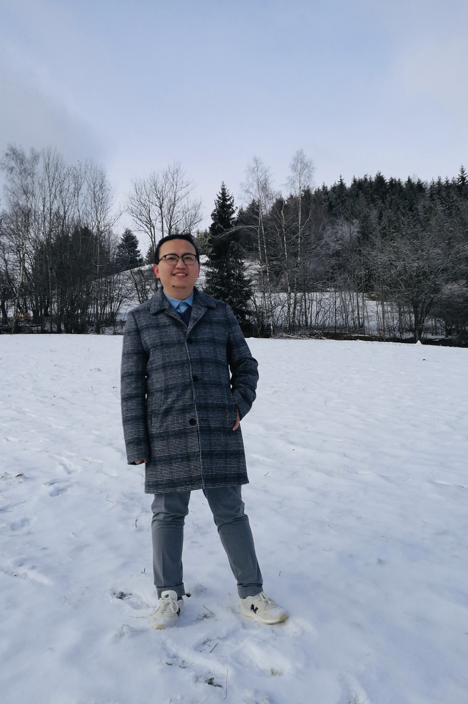

| [Accueil](index-fr.md)  | [Recherche](research-fr.md)    | [Enseignement](teaching-fr.md) | [Autres](others-fr.md)    |[English](index.md)    | [中文](index-ch.md) |

* * *
## Bienvenue!

Je suis Bingyu Zhang (张秉宇)

Institut Fourier, UMR 5582 du CNRS, Université Grenoble Alpes.

100 Rue des Mathématiques, 38610 Gières, France.

Bureau: 309

E-mail: bingyu.zhang@univ-grenoble-alpes.fr

Actuellement, je suis doctorant en première année de l'Institut Fourier à partir d'octobre 2019. Mes directeurs de these sont Damien Gayet (IF, UGA), Stéphane Guillermou (IF, UGA) et Claude Viterbo (ENS Ulm).

Voici mon [CV] (CV.pdf).

