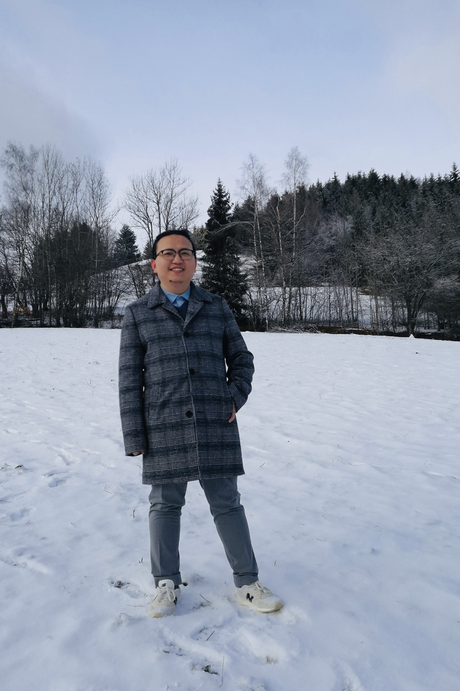

| [Home](index.md)  | [Research](research-en.md)    | [Teaching](teaching-en.md) | [Miscellaneous](miscellaneous-en.md)        | [中文](index-ch.md) |

* * *
# Welcome to my homepage on mathematics!
  

            
            
I am Bingyu Zhang (张秉宇).  My CV is here: <a href="Files/CV.pdf">CV</a>.

            
I am a Simons Assistant Professor (tenure-track AP) in the Department of Mathematics at the Kyiv School of Economics (KSE). Meanwhile, I will be a member of the Institute for Advanced Study for the Special Year Program (2026-27). 

            
Before joining KSE, I was a Post-Doc at the Centre for Quantum Mathematics in the University of Southern Denmark (SDU). I was working with Vivek Shende (2022-2025) and Jørgen Ellegaard Andersen (2025-2026). 

            
I received my PhD degree on Sep. 2022 from Institut Fourier at Université Grenoble Alpes under the supervision of Damien Gayet (IF, Université Grenoble Alpes), Stéphane Guillermou (LMJL, Université de Nantes), and Claude Viterbo (LMO, Université Paris-Saclay).

              
            
Address: Ø9-312c-1, Syddansk Universitet. 

            
Campusvej 55, 5230 Odense, Denmark.

            
E-mail: bzhang@kse.org.ua



