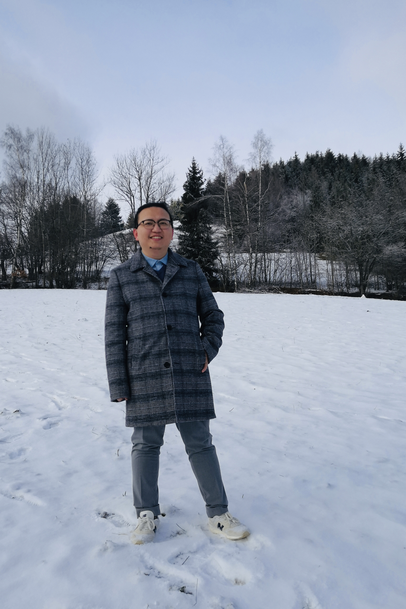

| [Home](index.md)  | [Research](research-en.md)    | [Teaching](teaching-en.md) | [Miscellaneous](miscellaneous-en.md)        | [中文](index-ch.md) |

* * *
# Welcome to my homepage on mathematics!
  

            
            
I am Bingyu Zhang (张秉宇).  My CV is here: <a href="Files/CV.pdf">CV</a>.

            
I will joint Department of Mathematics in Kyiv School of Economics as Simons Assistant Professor since May 2026. Meanwhile, I will be a member of Institute for Advanced Study for the Special Year Program (2026-27). 

            
Currently, I am a Post-Doc at Centre for Quantum Mathematics in the University of Southern Denmark (SDU). I am working with Vivek Shende (2022-2025) and Jørgen Ellegaard Andersen (2025-2026). 

            
I received my PhD degree on Sep. 2022 from Institut Fourier at Université Grenoble Alpes under the supervision of Damien Gayet (IF, Université Grenoble Alpes), Stéphane Guillermou (LMJL, Université de Nantes), and Claude Viterbo (LMO, Université Paris-Saclay).

              
            
Address: Ø9-301c-1, Syddansk Universitet. 

            
Campusvej 55, 5230 Odense, Denmark.

            
E-mail: bingyuzhang@imada.sdu.dk



