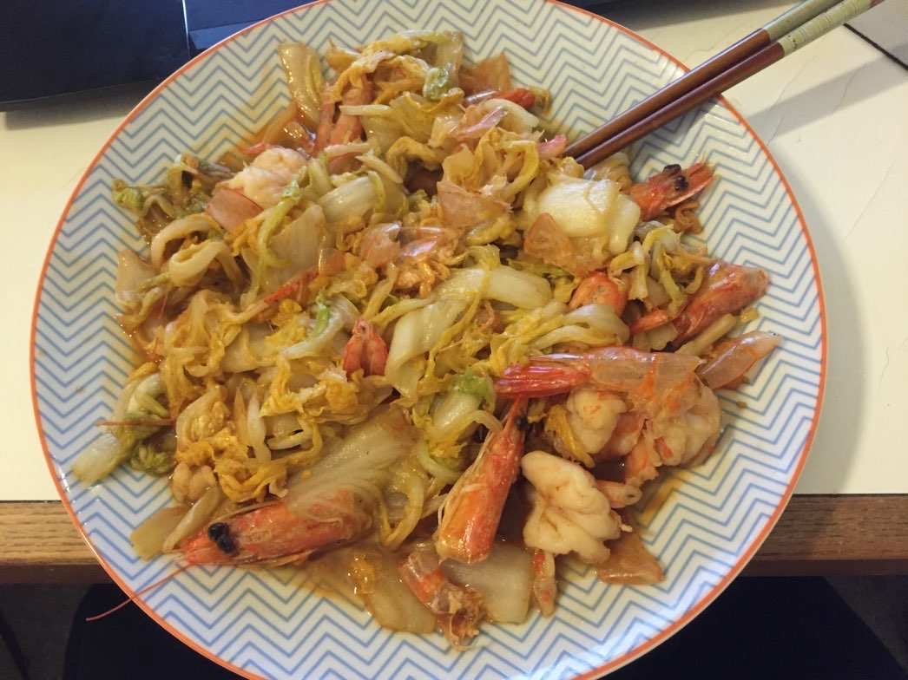
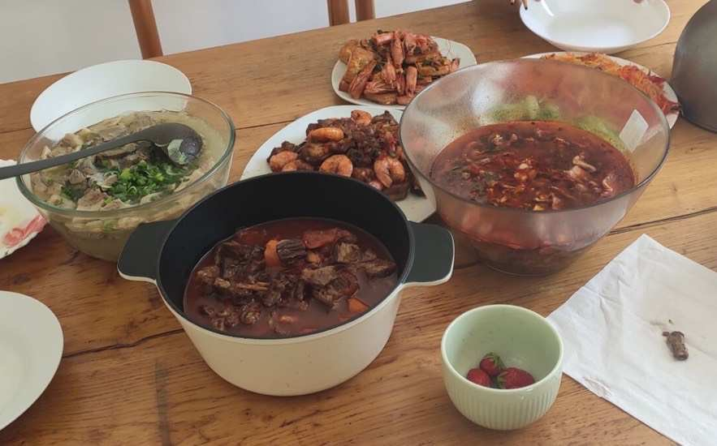
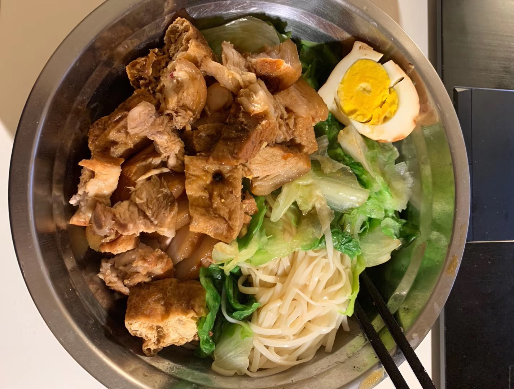
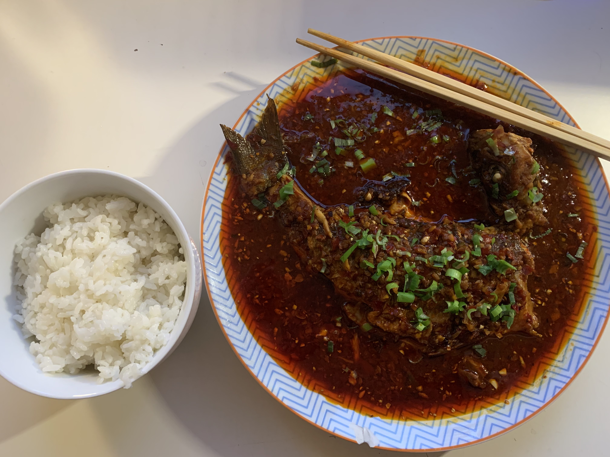

| [主页](index-ch.md)  | [研究](research-ch.md)    | [教学](teaching-ch.md)     |[杂项](miscellaneous-ch.md) |[English](miscellaneous-en.md)|   

# 常用链接

[Institut Fourier](https://www-fourier.ujf-grenoble.fr/)

[Séminaire Symplectix](http://symplectix.blogspot.com/)

[researchseminars](https://researchseminars.org/)

一个基于tikzcd绘制交换图的 [网站](https://tikzcd.yichuanshen.de/). 万分感谢作者!

# 烹饪

唯美食与数学不可辜负.

{:height="40%" width="40%"}{:height="40%" width="40%"}
{:height="40%" width="40%"}{:height="40%" width="40%"}
{:height="40%" width="40%"}{:height="40%" width="40%"}
{:height="40%" width="40%"}{:height="40%" width="40%"}

<meta name="googlebot" content="noindex" />
