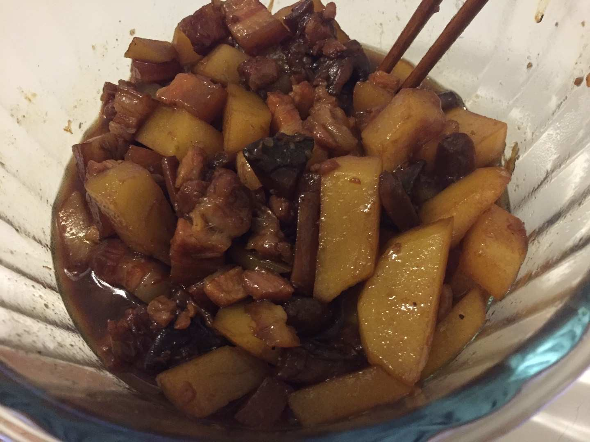

| [主页](index-ch.md)  | [研究](research-ch.md)    | [教学](teaching-ch.md)     |[其它](others-ch.md) |[English](others-en.md)|   

# 常用链接

[Institute Fourier](https://www-fourier.ujf-grenoble.fr/)

[Séminaire Symplectix](http://symplectix.blogspot.com/)

一个基于tikzcd绘制交换图的 [网站](https://tikzcd.yichuanshen.de/). 万分感谢作者!

# 烹饪

唯美食与数学不可辜负.

{:height="30%" width="30%"}
