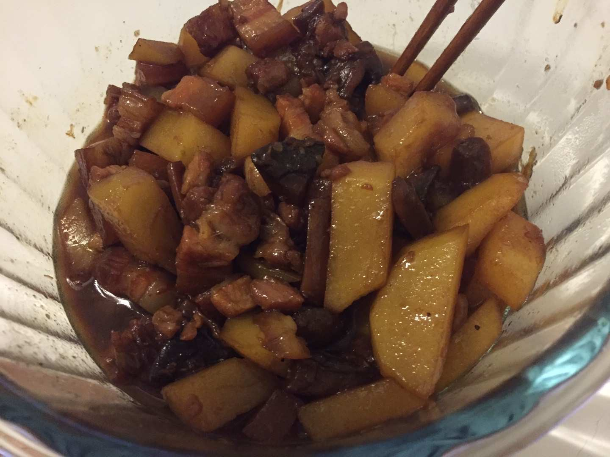
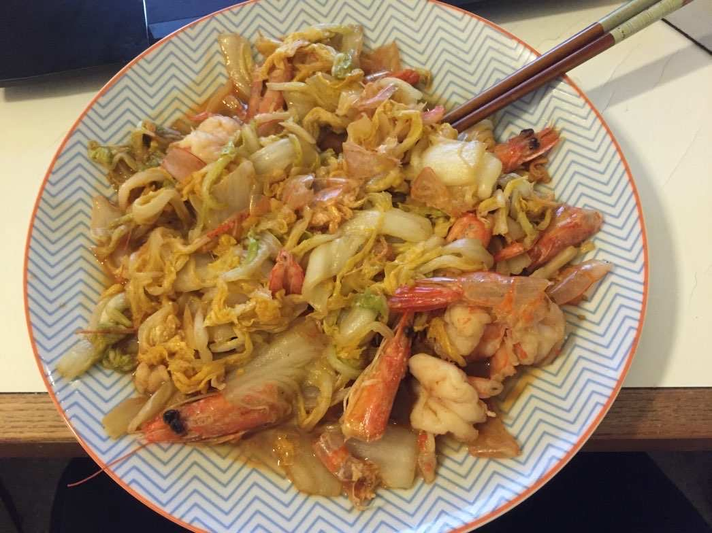
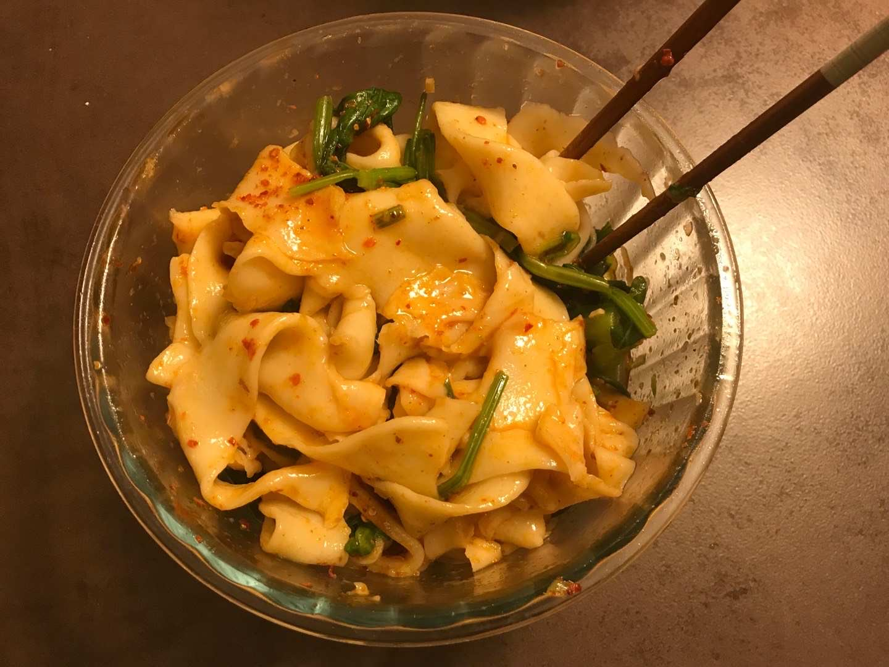
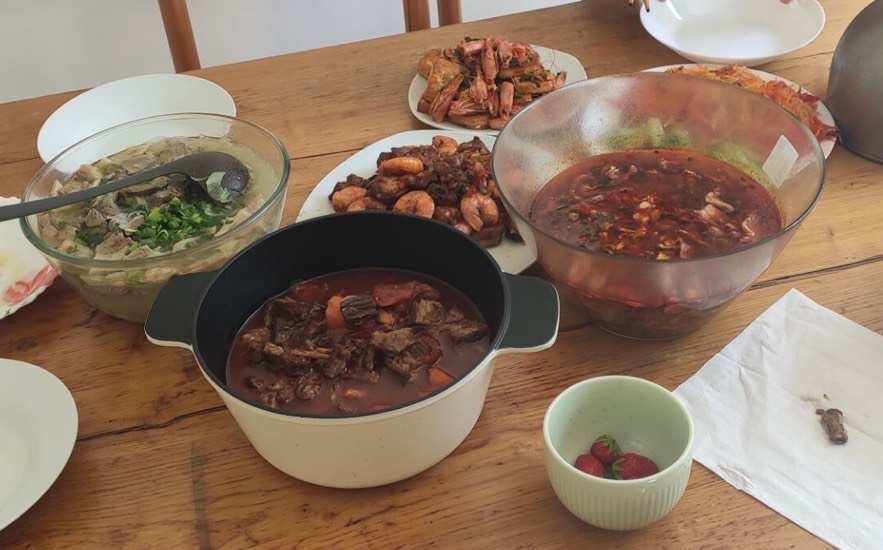
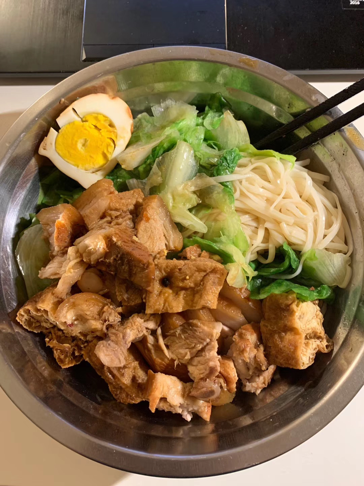
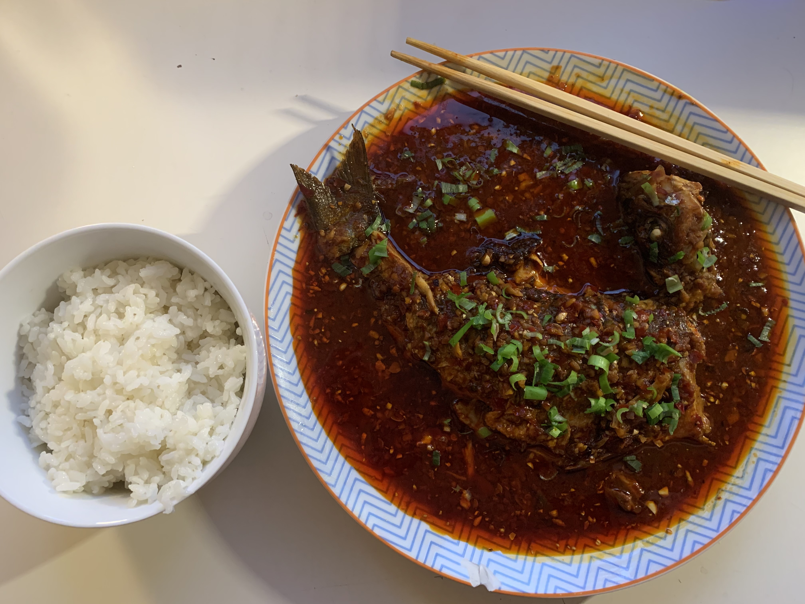

| [Accueil](index-fr.md)  | [Recherche](research-fr.md)    | [Enseignement](teaching-fr.md) | [Autres](others-fr.md)    |[English](others-en.md)              | [中文](others-ch.md) |

# Liens utiles

[Institute Fourier](https://www-fourier.ujf-grenoble.fr/)

[Séminaire Symplectix](http://symplectix.blogspot.com/)

Un [site Web] (https://tikzcd.yichuanshen.de/) pour créer un diagramme commutatif basé sur tikzcd. Merci beaucoup à l'auteur!

# Cooking

Ne regrette rien en matière de nourriture et de mathématiques.

{:height="40%" width="40%"}{:height="40%" width="40%"}
{:height="40%" width="40%"}{:height="40%" width="40%"}
{:height="40%" width="40%"}{:height="40%" width="40%"}
{:height="40%" width="40%"}{:height="40%" width="40%"}

<meta name="googlebot" content="noindex" />
