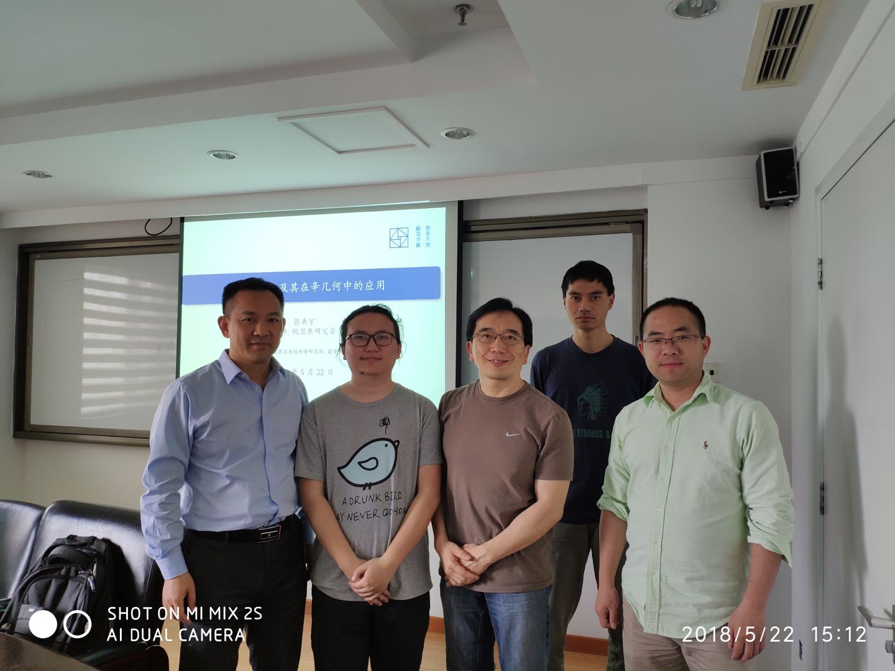
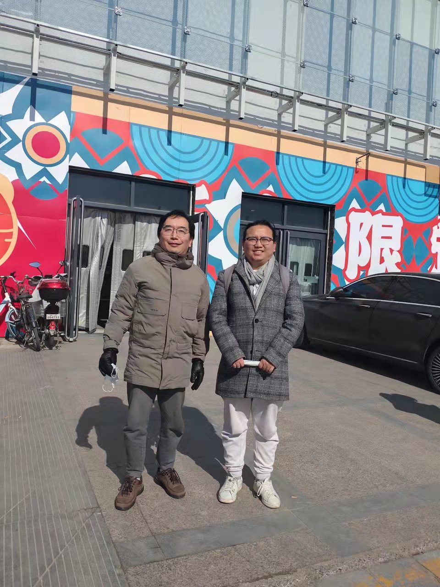
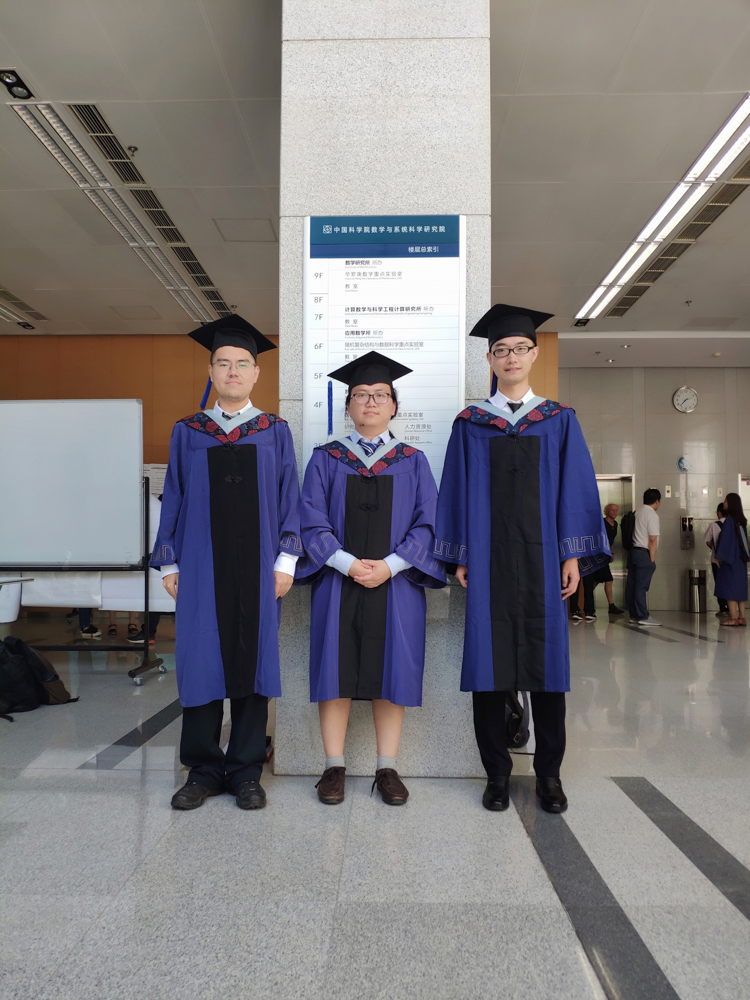

| [Home](index.md)  | [Research](research-en.md)    | [Teaching](teaching-en.md) | [Miscellaneous](miscellaneous-en.md)        | [English](people-en.md) |

<h1 style="text-align:center">感谢我生命中的每个人! </h1>

本人, 一岁左右.

  

博士答辩合照, 02/09/2022于傅里叶所.
 
  左起: Damien Gayet, Erwan Lanneau, 本人, Klaus Niederkrüger, Stéphane Guillermou, Claude Viterbo.

  

硕士答辩合照, 22/05/2018于中科院数学所.
 
  左起: 范辉军, 本人, 阮卫东, 李文威, 杨晓奎.

  

2022年傅里叶所中国学生合影.
 
  左列前起: 沙泽浩, 本人, 张一博.
   
  右列前起: 彭柯尧, 何志强, 李子玲.

  

2019年傅里叶所中国学者合影.
 
  左起: 饶胜, 本人, 吴晓俊, 高鸿灏, 王健.

  

与Bernard Malgrange和吴晓俊, 27/09/2022于傅里叶所.
 
纪念Jean-Pierre Demailly科学日.

  

与阮卫东, 20/02/2022于北京.

  

与白宸聿和秦翊宸, 07/2022于埃菲尔铁塔.

  

与张旭成和秦翊宸, 07/2022于杜塞尔多夫.

  

与肖玲和王占宇, 2018年于中科院数学所.

  

与文学清, 2018年于中科院数学所.

  

与周钰人和张旭成, 2018年于中科院数学所.

  

与丁林根, 廖小玲, 吴丹华, 2018年于湖南大学数学学院.

<meta name="googlebot" content="noindex" />
