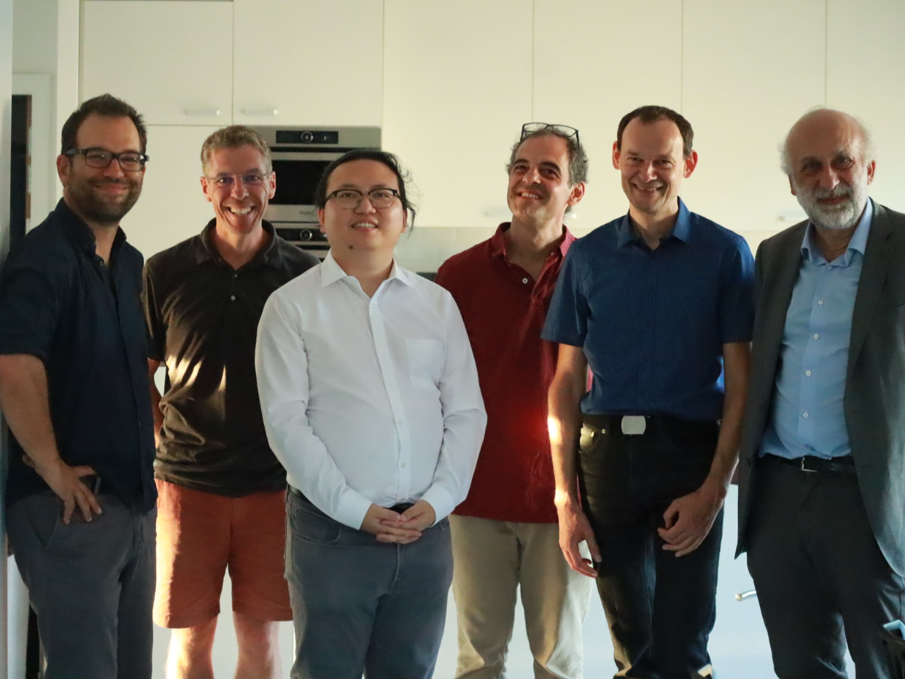
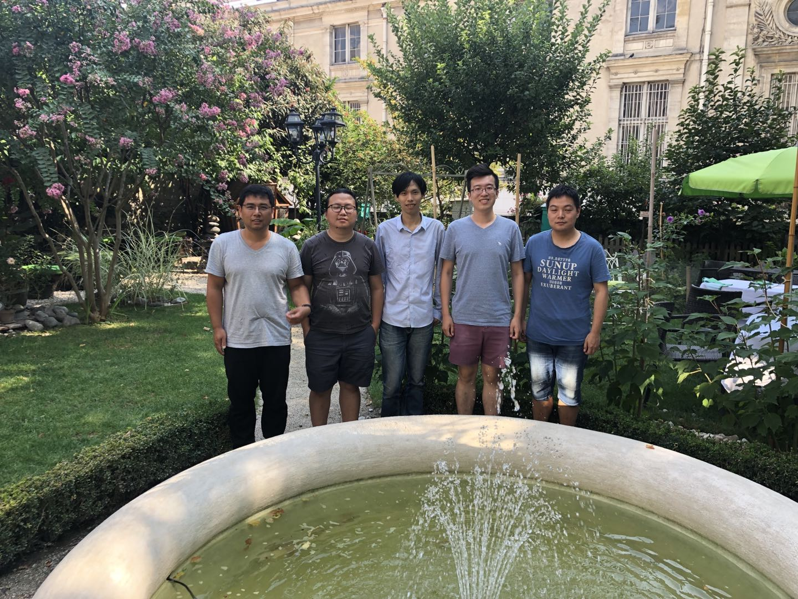
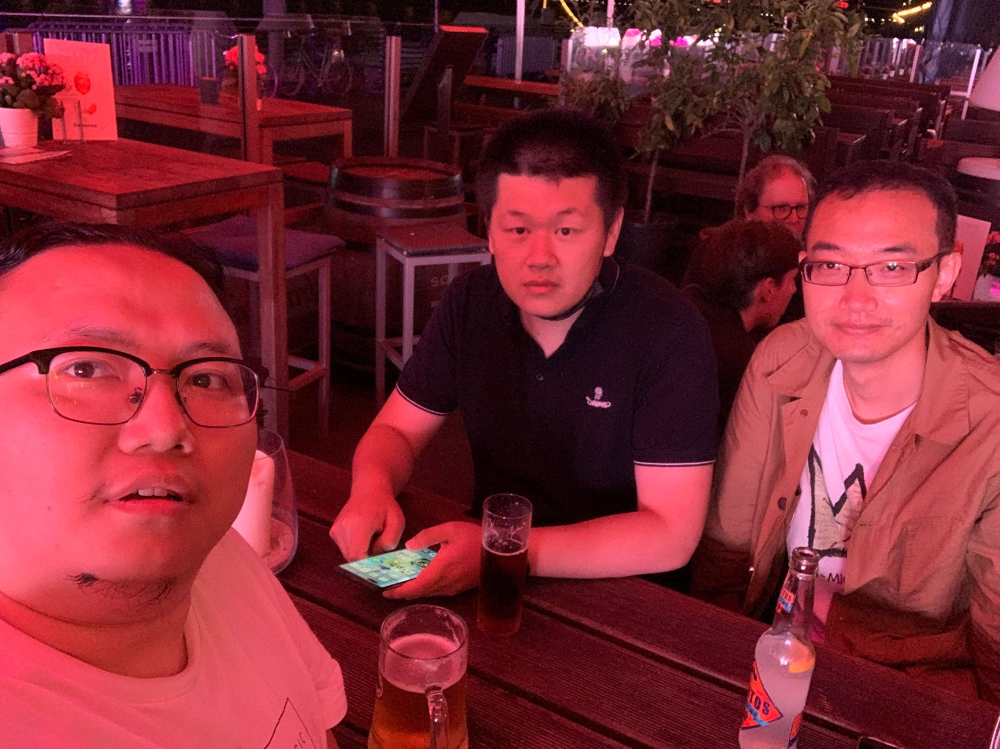

| [Home](index.md)  | [Research](research-en.md)    | [Teaching](teaching-en.md) | [Miscellaneous](miscellaneous-en.md)        | [中文](people-ch.md) |

<h1 style="text-align:center">Thanks every one in my life! </h1>

Myself, around 1 years old.

Group photo for my PhD defence on 02/09/2022 at IF.
 
  From left: Damien Gayet, Erwan Lanneau, me, Klaus Niederkrüger, Stéphane Guillermou, Claude Viterbo.

  

Group photo for my Master defence on 22/05/2018 at AMSS, CAS.
 
  From left: Huijun Fan, me, Weidong Ruan, Wenwei Li, Xiaokui Yang.

  

Group photo of Chinese students at IF in 2022.
 
  Left, from front: Zehao Sha, me, Yibo Zhang.
   
  Right, from front: Keyao Peng, Zhiqiang He, Ziling Li.

  

Group photo of Chinese scholars at IF in 2022.
 
  From left: Sheng Rao, me, Xiaojun Wu, Honghao Gao, Jian Wang.

  

With Bernard Malgrange and Xiaojun Wu on 27/09/2022 at IF.
 
La Journée scientifique en hommage à Jean-Pierre Demailly.

  

With Weidong Ruan on 20/02/2022 in Beijing.

  

With Chenyu Bai and Yichen Qin on 07/2022 at Eiffel Tower.

  

With Xucheng Zhang and Yichen Qin on 07/2022 at Düsseldorf.

  

With Ling Xiao and Zhanyu Wang in 2018 at AMSS, CAS.

  

With Xueqing Wen in 2018 at AMSS, CAS.

  

With Xucheng Zhang and Yuren Zhou in 2018 at AMSS, CAS.

  

With (from left) Linggen Ding, Xiaoling Liao and Danhua Wu in 2018,  at School of Mathematics Hunan University.

<meta name="googlebot" content="noindex" />
